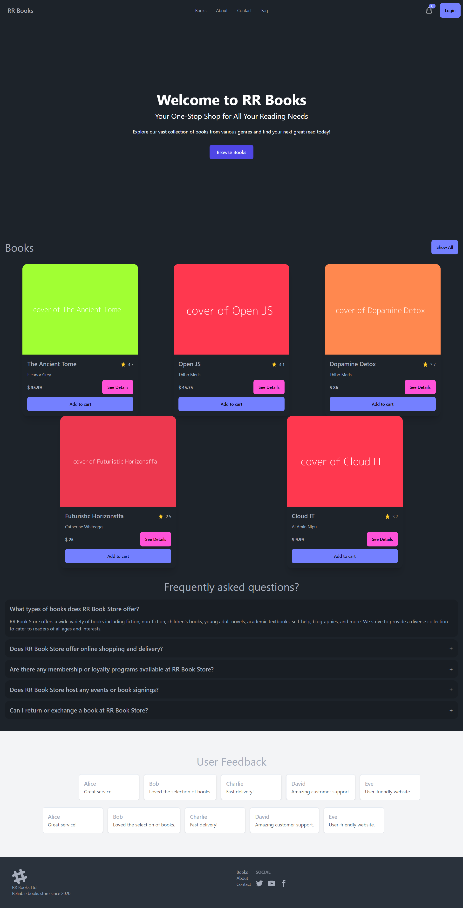
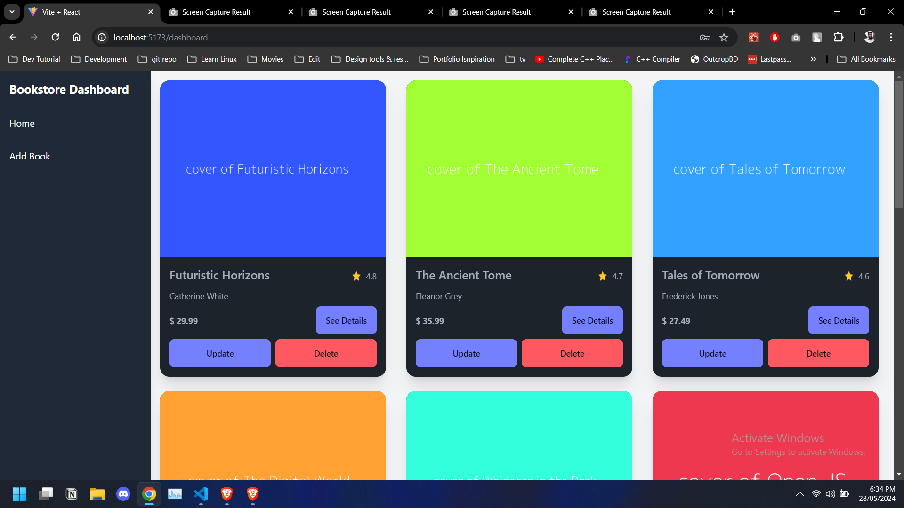
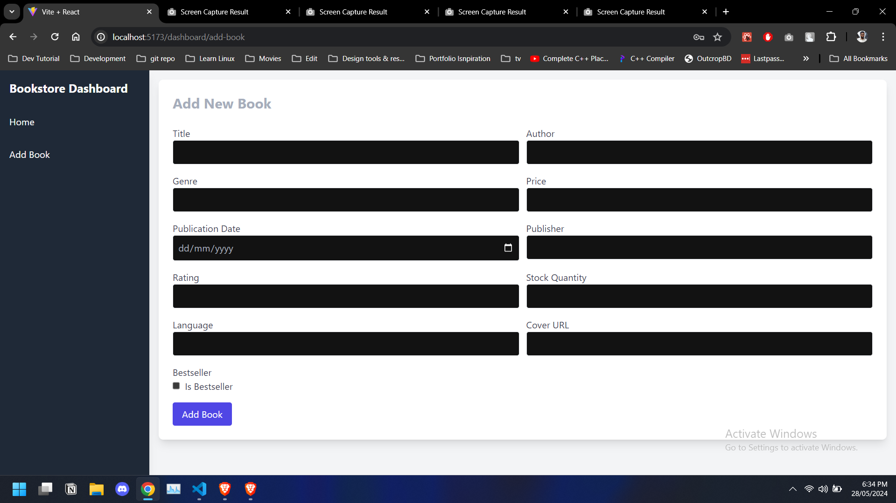

# RR Books

RR Books is an online platform for buying and selling books. The application allows users to browse and purchase books while providing administrative capabilities to add, update, and delete books.

## Installation and Setup

To get the project running locally, follow these steps:

1. **Clone the repository:**

   ```bash
   git clone <repository-url>
   cd rr-books
   ```

2. **Install dependencies:**

   ```bash
   yarn
   ```

3. **Start the frontend:**

   ```bash
   yarn dev
   ```

4. **Start the JSON Server:**
   ```bash
   npx json-server db.json --watch
   ```

## Credentials

1. **User:** Register using any method
2. **Admin:**

   ```bash
   email: admin@admin.com
   password: admin123

   ```

## Screenshots

### Homepage


_Browse our extensive collection of books._

### About Page


_Learn more about RR Books._

### Contact Page


_Get in touch with us for any inquiries._

### Admin Dashboard - Home


_Overview of the admin dashboard._

### Admin Dashboard - Add Book


_Admin interface for adding new books._
